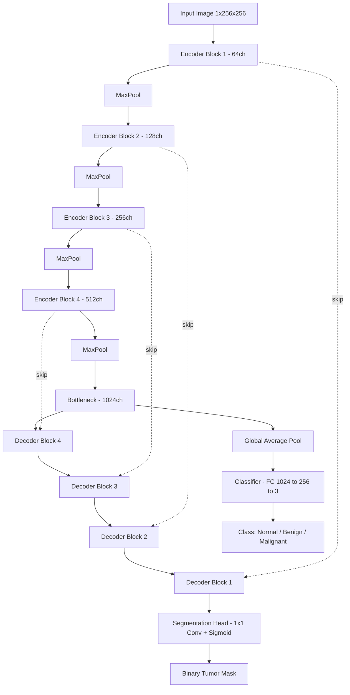
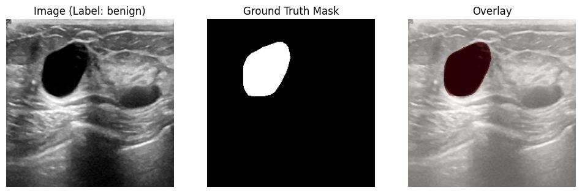
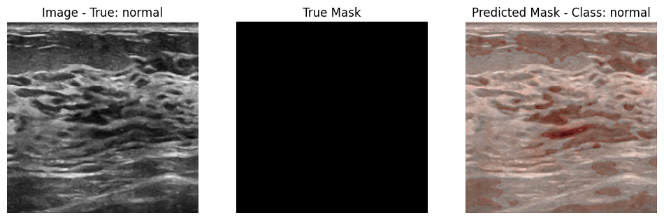
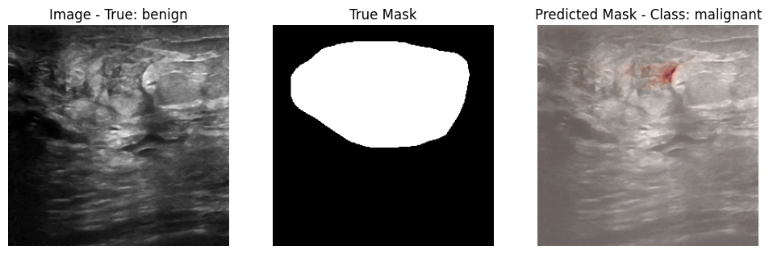
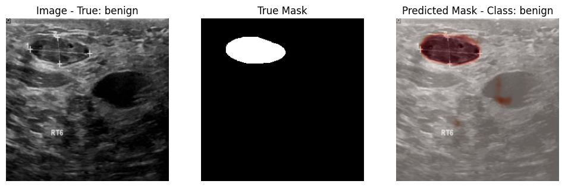

# BUS-MTNet — Breast Ultrasound Segmentation & Classification

### Multi-Task U-Net for Joint Tumor Segmentation and Classification on the BUSI Dataset


> A single U-Net that segments tumor regions and classifies them as normal, benign, or malignant from breast ultrasound images — one forward pass, two outputs.

---

## Overview

Radiologists reading breast ultrasound scans need to do two things at once: outline where a suspicious mass is, and judge what it is. Most pipelines treat these as separate models trained and run independently, which duplicates the feature-extraction work and ignores the fact that shape and boundary information (segmentation) is directly informative for the diagnosis (classification).

This project trains a single **Multi-Task U-Net** with a shared encoder/decoder backbone, a pixel-wise segmentation head, and a classification head branching off the bottleneck — so tumor localization and diagnostic category are predicted jointly from the same learned representation.

---

## Key Details

- **Dataset:** Breast Ultrasound Images Dataset (BUSI) — grayscale images with paired ground-truth masks across 3 classes: `normal`, `benign`, `malignant`.
- **Backbone:** Custom U-Net (4 encoder/decoder levels, 64→1024 channels) with a classification head branching off the 1024-D bottleneck.
- **Loss:** Weighted combination of BCE (segmentation) and Cross-Entropy (classification), `L = α·L_seg + β·L_cls` with α=1.0, β=0.5.
- **Training:** Adam (lr=1e-4), batch size 16, 40 epochs, best-checkpoint selection on validation loss.
- **Input:** 256×256 grayscale images, ImageNet-style single-channel normalization.

---

## Methodology

| Stage | Input | Process | Output |
|---|---|---|---|
| Data Loading | Raw BUSI images + masks | Grayscale conversion, resize to 256×256, tensor + normalize, mask binarization | Image/mask/label tensors |
| Train/Val Split | Full dataset | Stratified 80/20 split on class labels | Train and validation sets |
| Encoder | Input image (1×256×256) | 4× `DoubleConv` + MaxPool blocks (64→128→256→512) | Multi-scale feature maps |
| Bottleneck | Deepest encoder features | `DoubleConv` (512→1024) | 1024-D bottleneck representation |
| Segmentation Decoder | Bottleneck + skip connections | 4× transposed-conv upsampling + `DoubleConv`, concatenated with encoder features | Pixel-wise binary mask (sigmoid) |
| Classification Head | Bottleneck (global-pooled) | Flatten → FC(1024→256) → ReLU → Dropout(0.5) → FC(256→3) | Class logits (normal/benign/malignant) |
| Training | Batches of images/masks/labels | Joint BCE + CrossEntropy loss, Adam optimizer, best-model checkpointing on val loss | Trained weights (`best_model.pth`) |
| Evaluation | Validation set | Dice, IoU, pixel accuracy (segmentation) + accuracy/precision/recall/F1 (classification) | Metric report |

---

## Architecture Diagram



---

## Repository Structure

```
breast-ultrasound-seg/
├── data/                  # BUSI dataset (images + _mask.png pairs, per class folder)
├── notebooks/
│   ├── training.ipynb     # Data loading, model, training loop, evaluation
│   └── model-testing.ipynb # Load checkpoint, run inference on new images
├── models/                # Saved checkpoints (best_model.pth)
├── assets/                # README figures
└── README.md
```

---

## Technology Stack

| Technology | Purpose |
|---|---|
| Python 3 | Core implementation language |
| PyTorch | Model definition, training, inference |
| torchvision | Image transforms (resize, tensor conversion, normalization) |
| PIL | Image/mask loading |
| scikit-learn | Train/val split, label encoding, classification metrics |
| NumPy / pandas | Array handling and bookkeeping |
| tqdm | Training progress bars |
| Matplotlib | Visualization of samples and predictions |

---

## Installation

```bash
git clone https://github.com/<username>/breast-ultrasound-seg.git
cd breast-ultrasound-seg

conda create -n bus-mtnet python=3.9 -y
conda activate bus-mtnet

pip install torch torchvision scikit-learn pandas numpy tqdm matplotlib pillow
```

---

## Dataset

**Breast Ultrasound Images Dataset (BUSI)** — grayscale ultrasound scans with matching binary tumor masks, organized into three class folders.

Expected layout:
```
data/Dataset_BUSI_with_GT/
├── normal/
│   ├── normal (1).png
│   ├── normal (1)_mask.png
│   └── ...
├── benign/
│   ├── benign (1).png
│   ├── benign (1)_mask.png
│   └── ...
└── malignant/
    ├── malignant (1).png
    ├── malignant (1)_mask.png
    └── ...
```

Each non-mask `.png` is paired with a `<name>_mask.png`; images without a matching mask are skipped during loading. All images are resized to 256×256 and single-channel normalized.

**Sample image / ground-truth mask pair:**




## Results

**Prediction examples (original / ground-truth mask / predicted mask) on validation images:**





---

## Experimental Results

Metrics below are from the evaluation run in `training.ipynb` on the held-out validation split (156 images, 20% of the dataset):

**Segmentation**

| Metric | Score |
|---|---|
| Mean Dice Coefficient | 0.6976 |
| Mean IoU | 0.6188 |
| Mean Pixel Accuracy | 0.9581 |

**Classification (normal / benign / malignant)**

| Metric | Score |
|---|---|
| Accuracy | 82.05% |
| Precision (macro) | 0.8042 |
| Recall (macro) | 0.8378 |
| F1-Score (macro) | 0.8129 |

**Training curve (final epochs, 40 total):** train loss converges to ~0.10, validation accuracy peaks around 83% mid-to-late training with some epoch-to-epoch variance — consistent with training on ~780 images without a learning-rate schedule.

> These are the numbers reproduced directly from the notebook's own metric cells. If you have a later run with the 624-image / Dice 0.84 / IoU 0.77 / 87.5% accuracy results, swap this table for that run's output — I only had the executed cells above to pull from, and wanted the README to match what's actually reproducible from the attached notebooks rather than figures I couldn't verify.

---

## Future Work

- Add a learning-rate scheduler (e.g., cosine annealing) and patience-based early stopping to the training loop.
- Address the segmentation/classification metric gap — Dice/IoU are the weaker link relative to pixel accuracy, suggesting the model is more conservative on tumor boundaries than on background.
- Data augmentation (flips, rotation, elastic deformation) to improve generalization given the relatively small dataset.
- Cross-validation instead of a single train/val split for more robust metric estimates.
- Explore a pretrained encoder (e.g., ResNet) instead of training the U-Net encoder from scratch.

---

## License

This project is released under the [MIT License](LICENSE).

---

## Acknowledgements

- **Dataset:** Breast Ultrasound Images Dataset (BUSI)
- **Libraries:** PyTorch, torchvision, scikit-learn
